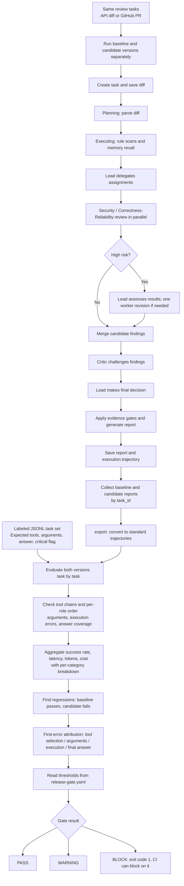

[简体中文](MODEL_RUNTIME_FLOW.md) | **English**

# EVO Runtime and Trajectory Regression Evaluation

The baseline and candidate versions review the same labeled task set. Each review report stores `execution.trajectory`. After collecting reports from both versions, run trajectory regression evaluation and the release gate as a separate step.



A task passes only if its expected tools, asserted arguments, answer text, and execution checks all pass. Parallel workers' tool sequences are aligned separately by role. The trajectory gate does not run automatically after a normal review; it needs reports from both versions and the same labeled JSONL task set.

```powershell
python -m evoagent.trajectory export --reports baseline_reports.json --output baseline_results.json
python -m evoagent.trajectory export --reports candidate_reports.json --output candidate_results.json
python -m evoagent.trajectory gate --tasks tasks.jsonl --baseline baseline_results.json --candidate candidate_results.json --config release-gate.yaml
```
