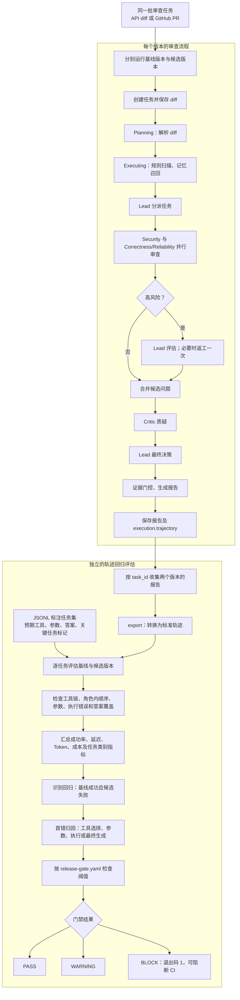

[**简体中文**](MODEL_RUNTIME_FLOW.md) | [English](MODEL_RUNTIME_FLOW.en.md)

# EVO 运行逻辑与轨迹回归评估

同一批标注任务分别由基线版本和候选版本执行。每次审查生成的报告保存 `execution.trajectory`；收集两个版本的报告后，再运行独立的轨迹回归评估和发布门禁。



单任务必须同时满足预期工具、预期参数、答案文本及无执行错误才算成功。并行角色的工具轨迹按角色分别对齐。普通审查完成后不会自动运行轨迹门禁；需要收集两个版本的报告，并提供同一份 JSONL 标注任务集。

```powershell
python -m evoagent.trajectory export --reports baseline_reports.json --output baseline_results.json
python -m evoagent.trajectory export --reports candidate_reports.json --output candidate_results.json
python -m evoagent.trajectory gate --tasks tasks.jsonl --baseline baseline_results.json --candidate candidate_results.json --config release-gate.yaml
```
